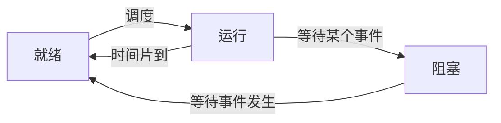
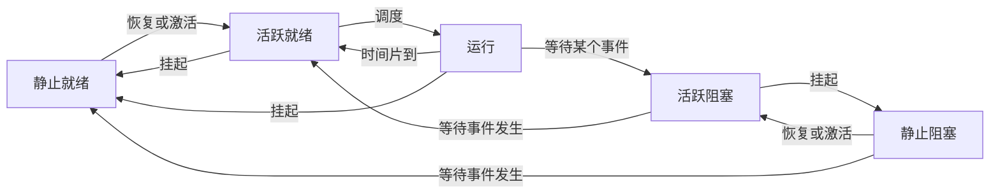

2022年5月左右的预测。


## 进程管理

进程：程序的运行实例，是系统进行资源分配和调度的一个独立单位。进程由程序块、进程控制块（PCB）和数据块三部分组成。其中**PCB**是进程存在的唯一标志。

线程可以被独立调度，但是只掌握程序计数器、寄存器和栈，不掌握更多资源；而进程还拥有内存地址空间、代码、数据等。

### 进程的状态





### PV操作

P操作对信号量执行减一，并判断此时信号量是否小于零；若小于零，则当前进程阻塞。

V操作对信号量执行加一，并判断此时信号量是否小于等于零；若小于等于零（说明有进程处于阻塞态），则唤醒一个等待中的进程。

> 假设某系统采用非抢占式优先级调度算法，若该系统有两个优先级相同的进程P1和P2，各进程的程序段如下所示，若信号量S1和S2的初值都为0。进程P1和P2并发执行后a、b和c的结果分别为多少？
>
> P1程序段
>
> ```
> a := 1;
> a := a + 1;
> V(S1);
> c := a + 5;
> P(S2);
> a := a + c;
> ```
>
> P2程序段
>
> ```
> b := 2;
> b := b + 1;
> P(S1);
> b := a + b;
> V(S2);
> c := b + c;
> ```

这道题的关键在于“非抢占式"，意志当进程从阻塞状态中进入就绪状态中时，进程不会立即抢占具有相同优先级的进程的CPU资源，而是会等到当前的CPU已经空闲出来了，才会执行后续语句。假设我们从P2开始，b等于3后被阻塞，执行P1；a等于2，c等于7后被阻塞；P2被唤醒后先就绪，然后从P(S1)位置后面继续执行；b等于5，c等于12，P2结束；执行P1最后一句a等于14，P1结束。即$a=14,b=5,c=12$。

### 前趋图

前趋图是一个有向无环图，表示一个或几个任务中，子任务之间的必要先后顺序。一个出度代表着一个V操作，一个入度代表着一个P操作。直接制约指的是一个任务中的必要次序，比如“扫描-处理-打印"这一次序是不能改变的。间接制约指的是多个平行任务间因为资源受限制产生的制约关系，比如三个文件都需要用扫描仪先扫描，那么三个文件的扫描子任务之间构成了间接制约关系。

> 进程P1、P2、P3和P4的前趋图如下所示
>
> ```mermaid
> flowchart LR
> P1 --> P2
> P1 --> P3
> P3 --> P2
> P2 --> P4
> P3 --> P4
> ```
>
> 若用PV操作控制进程P1-P4并发执行的过程，则需要设置5个信号量S1、S2、S3、S4和S5，且信号量S1-S5的初值都等于0。下图中a、b和c处应分别填写（）；de和处应分别填写（）
>
> ```mermaid
> flowchart LR
> s([start]) --P1执行--> a
> b --P2执行--> c
> d --P3执行--> e
> f --P4执行--> k([end])
> ```

这道题的破题关键在于找准出度和入度对应的PV操作，再结合选项，这样即可速度解题。a处一定有两个V操作，对应着P1的出度。

### 死锁

死锁的四大条件：

- 互斥
- 保持和等待
- 不剥夺
- 环路等待

死锁的预防关键在于打破死锁的四大条件。

死锁的避免有两个算法：有序资源分配法和银行家算法。

对于一个有3个进程，各需要5个系统资源的情况下，4个资源或以下一定死锁，5-12个资源会出于可能死锁的状态，13个资源一定不会死锁。

#### 银行家算法

对于银行家算法的计算，需要注意$T_0$时刻“已分配资源"的含义，这一部分的资源也是包含在系统可用资源中的。所以计算的时候，系统的真正可用资源需要扣除已分配资源数。然后我们先去满足资源要求低的进程，我们的可用资源也会随着进程对“已分配"资源的释放，变得更多。能顺利完成的进程的执行顺序称为安全序列。

## 存储管理

### 页式存储

将程序与内存均划分为同样大小的块，以页为单位将程序掉入到内存。页表存储：页号-块号（页帧号）的映射关系。在高级程序语言中，使用逻辑地址；在运行状态中，使用物理地址。页号应该作为逻辑地址的高位。

假设页面大小为4K，逻辑地址为5148H。鉴于$4\text{k}=4*2^{10}=2^{12}=2^{4*3}=(2^4)^3$，那么5148H的后三位就是页内的偏移量，5是页号，将5替换为页帧号，再加上148H即得到物理地址。

- 优点：利用率高，碎片小，分配及管理简单
- 缺点：增加了系统开销；可能产生抖动现象

状态位：1-在内存，0-不在内存；访问位：1-最近访问过，0-最近未被访问；修改为：1-内容被修改过，0-内容未被修改。淘汰的原理先看最近未被访问，再淘汰未被修改的页面。

### 段式存储

按用户作业中的自然段来划分逻辑空间，然后调入内存，段的长度可以不一样。段表存储：段号-段长-基址。逻辑段地址：段号+段内偏移量。

- 优点：多道程序共享内存，各段程序修改互不影响
- 缺点：内存利用率低，内存碎片浪费大

### 段页式存储

结合了段式和页式存储。先分段，再分页。每个段中有若干页，每个页大小相同，每个段大小不同。

- 优点：空间浪费小、存储共享容易、存储保护容易、能动态链接
- 缺点：管理软件增加，复杂性和开销也随之增加，需要的硬件以及占用的内存也有所增加，使得执行速度有所下降

### 快表

快表存储一些当前访问最频繁的少数活动页面的页号，并存储在Cache上；慢表则是将页表存储在内存上。

### 页面置换算法

这里的页面置换算法和Cache的置换算法相似，分为：

- 最优算法：理想情况，可以为其他算法做衡量
- 随机算法：如其名
- 先进先出算法：有可能产生抖动——在特定的序列下，更少的可用页面空间供给反而比更多页面空间供给发生中断调用的次数要更少
- 最近最少使用算法（LRU）：基于时间局部性原理，不产生“抖动"。
- 最近最不频繁使用算法（LFU）：每个数据块有个计数器，所有数据块按照引用计数排序，具有相同计数的按照时间排序。

## 文件管理


一般来说，第一级索引节点是13个。文件在逻辑上一定是连续的，在物理上可以是分散的。

位示图：位指的是一个比特，one bit，形似电影院的座位图。0代表空，1代表占用。位示图只考虑比特和字长。一个位置代表一个磁盘块。

文件名的组成：绝对路径+主文件名+扩展名

## 输入输出控制

数据传输控制方式，效率从低到高依次有：

- 程序控制（查询）方式
- 程序中断方式
- DMA方式
- 通道方式
- IO处理机

### IO中断流程

1. 当IO系统准备好以后，发出中断信号通知CPU
2. CPU接到中断请求，保存正在执行程序的上下文（保存现场），打断的程序当前位置即为断点
3. 通过中断向量表，转入IO中的服务程序的执行，完成IO系统的数据交换
4. 返回被打断的程序继续执行（恢复现场）

中断向量表保存中断处理程序的入口地址。

采用DMA方式处理IO的时候，不需要CPU执行程序指令来传送数据。CPU在一个总线周期结束时响应DMA请求。

IO管理软件是分层的，IO调用由用户进程发出到达硬件后，IO应答再从硬件一层层返回。

- 用户进程：发出IO调用
- 设备无关程序：设备名解析、阻塞进程、分配缓冲区
- 设备驱动程序：设置寄存器、检查设备状态
- 中断处理程序：IO完成后唤醒设备驱动程序
- 硬件：完成具体的IO操作

## 特殊的操作系统

### 微内核操作系统

微内核操作系统将众多的服务放在用户态，而仅保留最小的核心。

| 内核形态 | 实质                                               | 优点                                                                                                                     | 缺点                                                               |
| -------- | -------------------------------------------------- | ------------------------------------------------------------------------------------------------------------------------ | ------------------------------------------------------------------ |
| 宏内核   | 将图形、设备驱动、文件系统等<br />全部在内核中实现 | 减少进程间通信和状态切换的系统开销，<br />获得**较高的运行效率**                                                   | 内核庞大，占用资源多，<br />不易剪裁和移植<br />稳定性和安全性不高 |
| 微内核   | 只实现基本功能，<br />其余全放在内核态之外         | 内核精炼，便于剪裁和移植；<br />系统服务运行在用户地址空间，<br />系统的可靠性、稳定性和安全性较高<br />可用于分布式系统 | 用户态和内核态需要频繁切换，<br />从而导致系统效率不如宏内核       |

### 嵌入式操作系统

嵌入式操作系统的特点：微型化、代码质量高、专业化、实时性强、可裁剪可配置。

嵌入式开发中，宿主机与目标机系统由以太网、USB等链接，共同构成了交叉开发环境。

嵌入式系统要求硬件和软件上都要低功耗。硬件上：低功耗处理器、低功耗总线设计、分区分时供电技术等；软件上：编译优化技术（减少指令开销）、算法优化（降低时间复杂度）等。

### 实时操作系统

实时操作系统存在多种调度算法：

* 优先级调度算法：固定优先顺序，高优先级任务先执行
* 抢占式优先级调度算法：在优先级的基础上，允许高优先级任务抢占低优先级任务
* 时间轮转调度算法（基于优先级的抢占式时间轮转调度）：调度程序依次调度每个任务一个小的时间片，然后再调度另外一个任务。每个任务运行完一个时间片，强制释放CPU给下一个任务
* Latest Deadline First：倒着选，先选择截止时间最晚的，逆向构建任务顺序图
* Earliest Deadline First：正着选，先选择截止时间最早的，正向构建任务顺序图

在实时操作系统中，大多数调度算法都是抢占式的。


<style>#mermaid-1679053755209{font-family:sans-serif;font-size:16px;fill:#333;}#mermaid-1679053755209 .error-icon{fill:#552222;}#mermaid-1679053755209 .error-text{fill:#552222;stroke:#552222;}#mermaid-1679053755209 .edge-thickness-normal{stroke-width:2px;}#mermaid-1679053755209 .edge-thickness-thick{stroke-width:3.5px;}#mermaid-1679053755209 .edge-pattern-solid{stroke-dasharray:0;}#mermaid-1679053755209 .edge-pattern-dashed{stroke-dasharray:3;}#mermaid-1679053755209 .edge-pattern-dotted{stroke-dasharray:2;}#mermaid-1679053755209 .marker{fill:#333333;}#mermaid-1679053755209 .marker.cross{stroke:#333333;}#mermaid-1679053755209 svg{font-family:sans-serif;font-size:16px;}#mermaid-1679053755209 .label{font-family:sans-serif;color:#333;}#mermaid-1679053755209 .label text{fill:#333;}#mermaid-1679053755209 .node rect,#mermaid-1679053755209 .node circle,#mermaid-1679053755209 .node ellipse,#mermaid-1679053755209 .node polygon,#mermaid-1679053755209 .node path{fill:#ECECFF;stroke:#9370DB;stroke-width:1px;}#mermaid-1679053755209 .node .label{text-align:center;}#mermaid-1679053755209 .node.clickable{cursor:pointer;}#mermaid-1679053755209 .arrowheadPath{fill:#333333;}#mermaid-1679053755209 .edgePath .path{stroke:#333333;stroke-width:1.5px;}#mermaid-1679053755209 .flowchart-link{stroke:#333333;fill:none;}#mermaid-1679053755209 .edgeLabel{background-color:#e8e8e8;text-align:center;}#mermaid-1679053755209 .edgeLabel rect{opacity:0.5;background-color:#e8e8e8;fill:#e8e8e8;}#mermaid-1679053755209 .cluster rect{fill:#ffffde;stroke:#aaaa33;stroke-width:1px;}#mermaid-1679053755209 .cluster text{fill:#333;}#mermaid-1679053755209 div.mermaidTooltip{position:absolute;text-align:center;max-width:200px;padding:2px;font-family:sans-serif;font-size:12px;background:hsl(80,100%,96.2745098039%);border:1px solid #aaaa33;border-radius:2px;pointer-events:none;z-index:100;}#mermaid-1679053755209:root{--mermaid-font-family:sans-serif;}#mermaid-1679053755209:root{--mermaid-alt-font-family:sans-serif;}#mermaid-1679053755209 flowchart{fill:apa;}</style>
