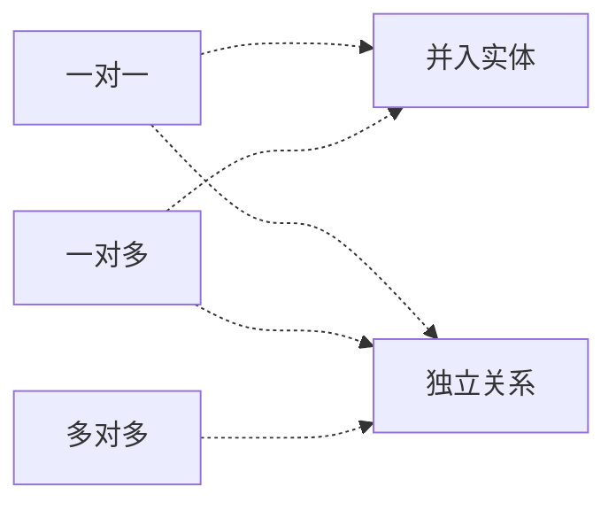

2022年5月左右的预测。

## 数据库体系结构

### 数据库关系

三种关系表：

- 基本关系（通常又称为基本表或基表）：实际存在的表，实际存储数据的逻辑表示。
- 查询表：查询结果对应的表。
- 视图表：由基表或其他视图表导出的表，本身不独立存储，数据库只存放它的定义，常称为虛表。

视图不存储数据，仅由SQL查询语句定义。每次查看视图，需要在原始表中执行查询语句。视图简化了操作，提供了相对的独立逻辑，保护了机密敏感数据。

物化视图：会存储数据，当原始表更新时，物化视图也会更新。适用于多查询、少更新的情况。

### 分布式数据库

分布式数据库的几个特性：

1. 数据独立性：数据逻辑独立性、物理独立性，外加分布独立性（也称分布透明性）；
2. 集中与自治共享结合的控制结构：局部DBMS与全局DBMS协同
3. 适当增加数据冗余度：提高系统的可用性
4. 全局一致性、可串形性和可恢复性

分布式数据库管理系统由如下几个部分组成：

1. LDBMS，局部
2. GDBMS，全局数据库管理系统
3. 全局数据字典
4. 通信管理

#### 分布式数据库的透明性

1. 分片透明：用户不知道数据的分片情况。水平分片（不同记录之间）、垂直分片（不同属性之间）、混合分片。
2. 复制透明：被复制的数据更新都由系统完成。
3. 位置透明：用户不知道数据物理存储在哪些节点上。
4. 局部映像透明：是最低层次的透明性。该透明性提供数据到局部数据库的映像。用户不知道局部的DBMS使用哪种语言，支持哪些数据模型。

#### 两阶段提交

两阶段提交（Two-Phase Commit, 2PC），有两个阶段组成：表决阶段和执行阶段。在表决阶段中，目的是形成一个共同的决定；在执行阶段中，目的是实现这个协调者的决定。

两阶段提交规则：只要有一个参与者撤销事务，协调者就必须做出全局撤销决定；只有所有参与者都同意提交事务，协调者才能做出全局提交决定。

## 数据库设计

四个流程：需求分析（数据流图、数据字典）、概念结构模型（ER模型）、逻辑结构设计（关系模型，规范化理论，开始考虑DBMS）、物理模型（索引，考虑硬件和操作系统）

### 概念结构设计

两个实体间的关系：一对一、一对多、多对多。

一般来说，先设计许多局部的ER图，再合并局部模型并消除冲突，最后重构优化、消除冗余。

### 逻辑结构设计

数据模型三要素：数据结构、数据操作、数据的约束条件

常见的数据模型：层次模型、网状模型、面向对象模型、关系模型

#### 关系模型的键

目或度：关系模型中属性的个数。

**候选键**：唯一标识元组，且无冗余。

**主键**：任选一个候选键。

主属性与非主属性：组成候选键的就是主属性，其他的就是非主属性。

**外键**：别的关系的主键

全键（全码）：关系模式中所有属性组成一个候选键时，称之为全码。

#### 完整性约束

实体完整性约束：基本关系的主键不能是空值——唯一且非空。

参照完整性约束：关系与关系间的引用，即外键要么是其他关系的主键，要么为空值。

用户自定义完整性约束：应用环境决定。

#### 逻辑结构设计流程

ER图向关系模式的转换、关系模式规范化、确定完整性约束、确定用户视图。

一个实体型必须转换为一个关系模式。

联系转关系模式则有多种：

- 一对一独立关系：需要并入两端主键及联系自身属性（主键：任一端主键）
- 一对一并入实体：在任意一端并入另一端主键及联系自身属性（主键不变）
- 一对多独立关系：并入两端主键及联系自身属性（主键：多端主键）
- 一对多并入实体：归并到多端，并入另一端主键及联系自身属性（主键不变）
- 多对多独立关系：并入两端主键及联系自身属性（主键：两端主键的组合键）

> 在数据库逻辑结构的设计中，将ER模型转换为关系模型应遵循相关原则。对于三个不同实体集和它们之间的多对多联系$m:n:p$最少可转换为**4**个关系模式。

三个实体必须是三个关系模式，多对多联系必须组成一个独立的关系，所以至少是四个关系模式。

## 关系代数

并交差，同构的二位表

笛卡尔积：属性列是二者之和，元组行是二者乘积（全组合）。$S_1\times S_2$

投影，选择：都是一元运算。投影是在属性中筛选需要的列（$\pi_{1,3,4}S_1$筛选第1、3、4列），选择是水平筛选满足条件的记录（$\delta_{1=4}$筛选第一列和第四列值相同的记录）。

连接：有多种连接方式。

### 自然连接

属性列：二者之和减去重复的属性列。元组行：保留相同属性具有同一值的记录。从性能的角度上来说，自然连接的性能优于笛卡尔积。

## 规范化理论

求候选键：将关系模式的函数依赖关系用“有向图"表示，找一个入度为零的属性，并以该属性为起点，尝试遍历有向图。若能正常遍历所有的结点，则该属性即为关系模式的候选键。若入度为零的属性不能遍历图中所有结点，则需要尝试将中间结点并入入度为零的属性中，再次按照前述方法寻找候选键。多个入度为零的键，可以组成复合键。

部分函数依赖：候选键是一个组合键，但是某些属性只依赖于候选键其中一个属性。

传递函数依赖：候选键经过中间属性传递，抵达其他不直接依赖主键的属性。

### Armstrong公理

自反律：若$Y\subseteq X\subseteq U$，则$X\rightarrow Y$成立。

增广律：若$Z\subseteq U$且$X\rightarrow Y$，则$XZ\rightarrow YZ$成立。

传递律：若$X\rightarrow Y$且$Y\rightarrow Z$，则$X\rightarrow Z$成立。

合并规则：由$X\rightarrow Y$，$X\rightarrow Z$，有$X\rightarrow YZ$。（增广+传递）

伪传递规则：由$X\rightarrow Y$，$WY\rightarrow Z$，有$XW\rightarrow Z$。（增广+传递）

分解规则：由$X\rightarrow Y$及$Z\subseteq Y$有$X\rightarrow Z$。（自反+传递）

### 范式

- 第一范式：字段原子化，属性值不可再分；
- 第二范式：非主属性没有对候选键的部分依赖；
- 第三范式：非主属性没有对候选键的传递依赖；
- Boyce-Codd范式：所有依赖的决定因素必然包含某个候选键；
- 第四范式：消除非平凡依赖关系，即消除表内的多对多关系，仅保持一对多。

### 模式分解

保持函数依赖分解：关系分解后，依赖关系与原关系等价的话，我们认为关系依赖集合保持。分解后如果存在可以被推到的依赖，称为冗余函数依赖，冗余函数依赖不影响对函数依赖的保持的判断。

无损分解：指将一个关系模式分解成若干个关系模式后，通过自然连接和投影等运算仍能还原到原来的关系模式。判断无损分解可以画表来分析。

## 数据库控制技术

### 并发控制

事务的ACID特性：原子性、一致性、隔离性、持续性。

- 原子性：全部成功并提交，或者全部失败并回滚；
- 一致性：事务执行前后，数据库完整性没有被破坏，写入的数据必须符合预设约束；
- 隔离性：可以防止多个事务并发交叉执行导致的数据不一致；
- 持久性：事务结束后，对数据的修改是永久的，那么系统出故障。

并发产生的问题：

- 丢失更新：一个事务修改的数据未提交，就被另一个事务按照前一个事务修改前的数值进行其他修改。
- 脏读：当一个事务允许读取另外一个事务修改但未提交的数据；
- 不可重复读：在一次事务中，当一行数据获取两遍得到不同的结果；
- 幻影读：在事务执行过程中，当两个完全相同的查询语句执行得到不同的结果集；

解决方式——隔离级别与加锁协议

| 隔离级别                                                                               | 丢失更新 |   脏读   | 不可重复读 |  幻影读  |
| -------------------------------------------------------------------------------------- | :------: | :------: | :--------: | :------: |
| 一级加锁协议 修改数据时加上互斥锁， 事务结束后释放                           |  不发生  | 可能发生 |  可能发生  | 可能发生 |
| 二级加锁协议 在一级加锁的基础上， 读取数据前加上共享锁， 读取后释放     |          |  不发生  |  可能发生  | 可能发生 |
| 三级加锁协议 在一级加锁的基础上， 读取数据前加上共享锁， 事务结束后释放 |          |          |   不发生   | 可能发生 |
| 两阶段协议 可串形化执行事务                                                       |          |          |            |  不发生  |

### 数据库备份与恢复

冷热备份：冷备份是在数据库关闭的情况下，全部备份文件；热备份按照需求，快速备份运行中的数据库文件。

完全备份、差量备份和增量备份：完全备份是备份所有数据；差量备份仅备份上一次**完全**备份后变化的数据；增量备份仅备份上一次备份之后变化的数据。

事务日志是针对数据库改变所做的记录，它记录针对数据库的任何操作，并将结果保存在独立的文件中。

撤销事务：故障发生时未完成的任务，放入Undo撤销；重做事务：故障发生前已提交的任务，放入Redo重做。
