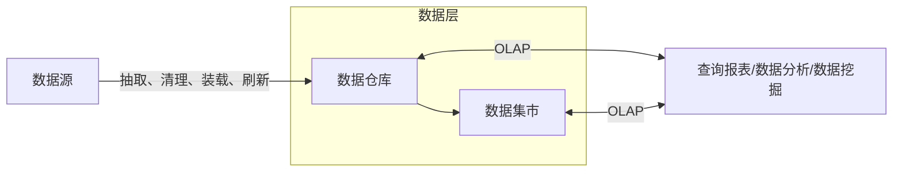

2022年5月左右的预测。

## 信息与信息化的概念

信息的定义：信息就是不确定性的减少。

维纳：信息就是信息，既不是物质，也不是能量。

信息的传递性：信息在时间上的传递即是存储；在空间上的传递即是转移或扩散。

信息化是从工业社会到信息社会的演进与变革。

## 信息系统战略规划

- 第一阶段：**以数据处理为核心**，围绕职能部门需求。主要有企业系统规划法（BSP）、关键成功因素法（CSF）、战略集合转化法（SST）。
- 第二阶段：**以企业内部MIS为核心**，围绕企业整体需求。主要有战略数据规划法（SDP）、信息工程法（IE）、战略栅格法（SG）。
- 第三阶段：综合考虑企业内外环境，**以集成为核心**，围绕企业战略需求。主要有价值链分析法（VCA）、战略一致性模型（SAM）。

关键成功因素法（CSF）：找到一家企业的成功关键点，然后在企业的核心竞争力上面确定信息系统战略，优先开发核心竞争方向，抓住主要矛盾，确定开发的顺序。

战略集合转化法（SST）：将企业的战略目标信息集合转化为信息系统的战略目标。

企业系统规划法（BSP）：自上而下的规划与自下而上的实现相结合的做法。通过UC矩阵（Use/Create Matrix），将功能与数据的关系捋清，从而据此划分子系统。

## 电子政务

电子政务主要有3类角色：政府、企事业单位、公民，有时还有公务员。

以下是几个易错的典型分类：

| 类型                | 应用                                                                                         |
| ------------------- | -------------------------------------------------------------------------------------------- |
| G2G                 | 基础信息的采集、处理和利用，如人口信息                                                       |
| G2E (Employee) | 政府内部管理系统，管理公务员                                                                 |
| G2B                 | 政府给企业颁发营业执照、许可证、合格证、质量认证等                                           |
| B2G                 | 企业向政府缴税，企业向政府提建议、申诉， 企业向政府提供商品及服务（**含竞投标**） |
| G2C                 | 户口、各种证件和牌照的管理                                                                   |
| C2G                 | 个人向政府反馈民意（**征求群众意见**）                                                 |

## 各种商业系统

### 企业资源计划 ERP

演进过程：从以物料单为代表的物料需求计划（MRP），再到加入库存、分销等模块的制造资源计划（MRPII），最后到打通了供应链，融合了财务、人力资源、销售管理等的企业资源计划（ERP）。

ERP是一种管理思想的变革。不是开箱即用的软件产品，需要一定的个性化开发与部署。它有众多的子系统，是互联互通的，便于事前事中监控。

### 客户关系管理 CRM

市场营销和客户服务是CRM的支柱性功能。

### 供应链管理 SCM

打通供应商、制造商、分销商、零售商之间的信息孤岛，整合优化“三流"，有严格的数据交换标准。

“三流"：信息流（需求与供应信息流）、资金流、物流

### 商业智能 BI

商业智能：数据仓库、OLAP-联机分析处理、数据挖掘，用于决策分析

普通应用开发：应用数据库、OLTP-联机事务处理，用于支撑业务运作

数据仓库的特点：面向主题、集成（一个企业一个仓库）、相对稳定非易失（CRUD少）、反映历史变化（时变的）

OLAP支持上卷、下钻和旋转分析。

数据挖掘的几种模式分类：关联分析、序列模式分析（因果关系）、分类分析、聚类分析。

### 数据湖

数据湖一个存储企业原始数据的大型仓库，其中的数据可供存取、处理、分析和传输。数据湖中的数据涵盖了**结构化和完全非结构化数据**。

数据仓库仅支持分析处理；数据湖支持分析，同时还支持事务处理。数据仓库中数据价值是提前明确的，数据湖中的数据价值尚未明确。

数据仓库是多数据源集成，干净安全，转换一次，多次使用；数据湖有无限扩展性、支持编程框架、并行执行。

### 业务流程重组 BPR 与 业务流程管理 BPM

BPR：颠覆原有流程、彻底性的再设计

BPM：使用PDCA（计划、执行、检查、行动）循环，持续改进

## 企业应用集成

- 表示集成（界面集成）：套壳
- 数据集成（绕开应用逻辑，直接操作数据库）
- 控制集成（应用集成、API集成）
- 业务流程集成（过程集成，B2B），比控制集成高在业务优化方面，跨企业
- 门户集成：将内部网络与互联网连接

门户分为：信息门户（访问内部信息）、知识门户（软件文档说明）、应用门户（商业流程共享）、垂直门户（领域信息）。

从共享的特点来看，分为：消息集成、共享数据库、文件传输三种方式。

- 消息集成：数据量小，即时，异步
- 共享数据库：交互频繁，同步
- 文件传输：数据量大，交互频率低，即时要求低

按组织范围来分，有内部集成和外部集成之分。内部集成由低到高为：技术平台集成、数据集成、应用系统集成、业务过程集成。外部集成主要为**门户网站和互联网**实现内外部信息集成，和与合作伙伴**对接信息系统**建立动态的企业联盟。

企业集成平台是一个支持复杂信息环境下信息系统开发、集成和协同运行的软件支撑环境。

- 面向信息的集成：解决企业内数据共享问题
- 面向过程的集成：对业务过程逻辑和应用逻辑进行分离，实现过程建模和数据、功能的分离
- 面向服务的集成：实现（企业间）具有松散耦合关系的不同应用间的互操作
