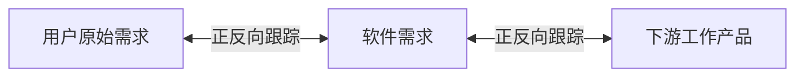
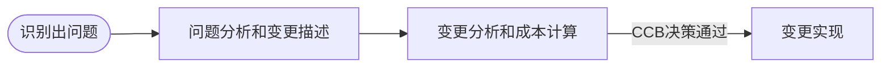

2022年5月左右的预测。

## 需求工程概述

软件需求指用对系统在功能、行为、性能、设计约束等方面的期望。需求工程分为需求开发和需求管理。

需求开发分为：

- 需求获取
- 需求分析
- 需求定义：产生需求规格说明书SRS
- 需求验证：形成需求基线，即经过评审的SRS。需求基线是用户和开发经过评审，达成共识的SRS。

需求管理是对需求基线进行管理：变更控制、版本控制、需求跟踪、需求状态跟踪。

## 需求开发

### 需求分类

* 业务需求（整体全局）
* 用户需求（用户视角）
* 系统需求（计算机化）
  * 功能需求
  * 性能需求
  * 设计约束

从质量工程展开的维度，可以分为：

* 基本需求（明示，常规）
* 期望需求（隐含）
* 兴奋需求（超出预期）

PIECES框架（非功能需求分类）：

- Performance 性能：描述当前的运行效率，业务的处理速度
- Information 信息：描述数据的输入、输出及处理存在的问题
- Economics 经济：从成本和收益的角度分析问题
- Control 控制：提高信息系统的安全控制水平
- Efficiency 效率：提高企业的人、财、物的使用效率
- Service 服务：提高服务质量

### 需求获取

- 收集资料：把与系统有关的、对系统开发有益的信息收集起来
- 阅读历史文档：对手机数据性的信息较为有用
- 用户访谈：对有代表性的用户了解**主观**想法，成本高，要有领域知识支撑
- 问卷调查：用户多，成本低
- 现场观摩：针对较为**复杂的流程**
- 参加业务实践：有效地发现**问题的本质**和寻找问题的办法
- 联合需求计划（JRP）：高度组织的群体会议，**各方参与**，了解想法，消除分歧，交互好，成本高
- 情节串联板（原型前身）：一系列图片，用图片讲故事
- 抽样调查：基于数理统计，降低成本，快速获取，$样本大小 = \alpha \times (\frac{可信度系数}{可接受的错误})^2$

### 需求分析

结构化开发中的三种模型：功能模型（数据流图）、行为模型（状态装换图）、数据模型（实体联系图）。

数据流图，也叫做分层数据流图，粗粒度的数据流图可以继续细化。数据流图的四大要素：数据流、加工、数据存储、外部实体。

状态转换图的两个要素：状态（初态、终态）、事件

对象三要素：对象ID、属性、方法

- 实体类：映射需求中的实体
- 控制类：控制用例工作的类（动宾结构），如“身份验证器"
- 边界类：封装在用例内、外流动的信息或数据流

### UML

UML是一组工具集。主要有三个组成部分，分别是构造块、规则和公共机制。

公共机制包含规格说明（事务语义细节描述）、修饰（表达更多信息）、公共分类（类与对象、接口与实现）和扩展机制（允许添加新规则）。规则包括范围（给一个名字以特定范围的语境）、可见性（怎样使用或看见名字）、完整性（事物如何正确、一致地相互联系）和执行（运行或模拟动态模型的含义是什么）。

构造块分为事物、关系和图。事物主要包含以下四种：

- 结构事物：最静态的部分，包括类、接口、协作、用例、活动类、构件和节点。
- 行为事物：代表时间和空间上的动作，包括消息、动作次序、连接。
- 分组事物：看成一个盒子，包括包、构件。
- 注释事物：UML模型的解释部分。

UML图分为静态图（结构图）和动态图（行为图）。

静态图部分（只需要额外关注部署图）：

- 类图：一组类、接口、协作和它们之问的关系
- 对象图：一组对象及它们之间的关系
- 构件图：一个封装的类和它的接口
- **部署图：软硬件之间映射**
- 制品图：系统的物理结构
- 包图：由模型本身分解而成的组织单元，以及它们之间的依赖关系
- 组合结构图

动态图部分，重点：

- 用例图：系统与外部参与者的交互
- 顺序图：强调按时间顺序
- 通信图（协作图）
- 状态图：状态转换变迁
- 活动图：类似程序流程图，并行行为
- 定时图：强调实际时间
- 交互概览图

其中顺序图、通信图、定时图、交互概览图又叫做“交互图"。

UML“4+1"视图

- 用例图：最终用户
- 逻辑图：系统分析、设计人员——类与对象，突出功能
- 实现视图：程序员——物理代码文件和组件
- 进程视图：系统集成人员——线程、进程、并发
- 部署视图：系统和网络工程师——软件到硬件的映射

面向对象的需求建模主要建立用例模型和分析模型。

### 需求定义

- 严格定义法：所有需求都能够被预先定义、开发与用户之间能够准确清晰的交流、图形文字可以充分体现最终系统。
- 原型法：并非所有的需求都能在开发前被准确的说明。

### 需求验证

需求评审和需求测试会邀请到用户参加，用户签字确认需求规格说明书形成需求基线。

## 需求管理

需求要么通过“被建议、被批准、被实现、被验证、被交付"这条线完成，要么未通过评审，要么在各个环节被取消而结束。

### 需求跟踪

在跟踪中，我们可以使用矩阵确定需求状态。

### 需求变更

## 软件系统建模

主要分为：结构化建模（DFD数据流图）、信息工程建模/数据库建模（ERD实体联系图）、面向对象建模（UML）

