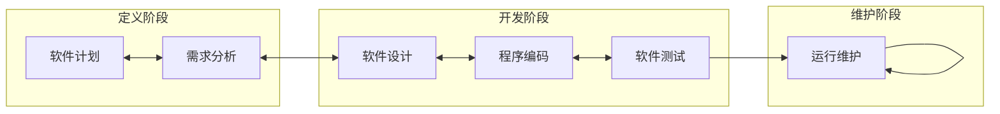
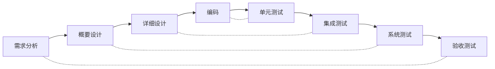
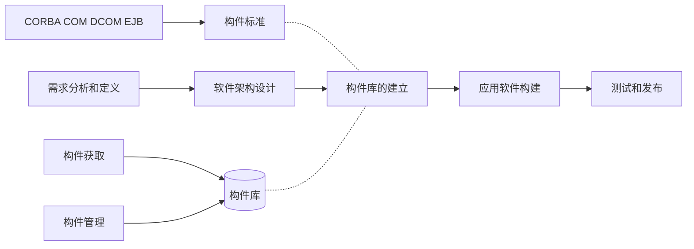
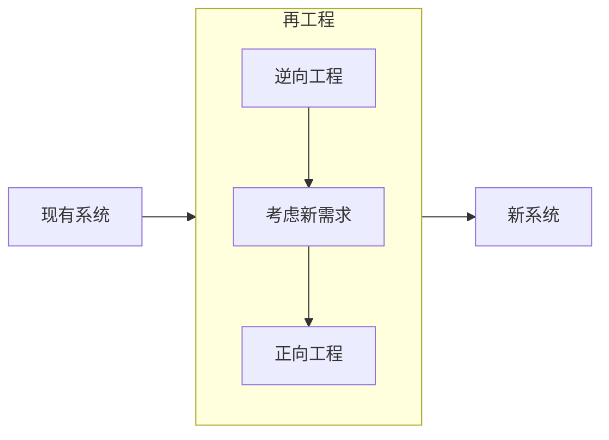
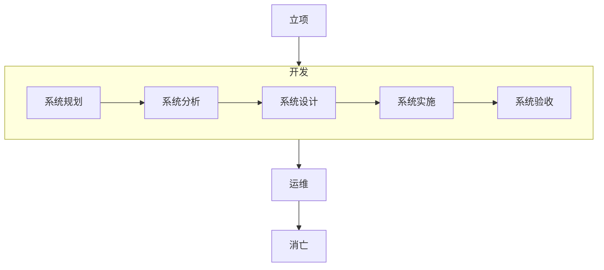

2022年5月左右的预测。

## 软件开发方法

主要有结构化方法、面向对象方法和面向服务方法。

1. 结构化方法：**自顶向下**，严格分阶段，阶段产出标准化，应变能力差；
2. 面向对象方法：自底向上，符合人们思维习惯，更好应变；
3. 面向服务方法：粗粒度、松耦合，标准化和构件化，抽象从操作、服务到业务流程。

原型法，针对需求不明确时，按功能可分为水平原型（界面）和垂直原型（复杂算法）；按最终结果可分为：抛弃式原型和演化式原型。

## 经典软件开发模型

### 瀑布模型（SDLC）

### 螺旋模型

- 增量：一个一个子系统完成的；
- 迭代：一开始就有全面的草图，再逐步全面分阶段完善。

螺旋模型是原型和瀑布模型的结合，并引入了风险分析阶段。

### V模型与喷泉模型

V模型主旨是测试贯穿始终。

喷泉模型是迭代的，没有间隙，是早期著名的面向对象模型。

### 构件组装模型（CBSD）

### 快速应用开发模型（RAD）

瀑布模型与构件组装模型融合形成了快速应用开发模型。大量运用构件，适用于开发模块化系统。

### 统一过程模型（UP/RUP）

统一过程有三大特点：用例驱动、以架构为中心、迭代和增量。

有四个阶段：

- 初始：定义最终视图和业务模型、确定系统范围
- 细化：设计及确定系统架构、制定工作计划和资源要求
- 构件：构造产品并继续演进需求、架构、计划直至产品提交
- 交付：把产品提交给用户使用

## 敏捷方法

价值观：

- 沟通，加强面对面沟通
- 简单，不过度设计
- 反馈，及时反馈
- 勇气，接受变更的勇气

集中具体的敏捷方法和它们的特点：

- 极限编程 (XP）：一些对费用控制严格的公司中的使用，非常有效。
- 水晶方法：探索了用最少纪律约束而仍能成功的方法，从而在产出效率与易于运作上达到一种平衡。
- 开放式源码：程序开发人员在地域上分布很广（其他方法强调集中办公）。
- SCRUM：明确定义了的可重复的方法过程。
- 功用驱动开发方法 (FDD）：编程开发人员分成两类：首席程序员和“类"程序员。
- ASD方法：其核心是三个非线性的、重叠的开发阶段：猜测、合作与学习。

Scrum的每一次冲刺不会完成所有开发，每次冲刺时间较短，约2～4周为一个周期。

## 逆向工程

逆向工程是设计的恢复过程。

- 实现级：抽象语法树、符号表、过程的设计表示
- 结构级：程序分量之间相互依赖关系，如调用图、结构图、程序及数据结构
- 功能级：程序段功能及程序段，如数据和控制流模型
- 领域级：应用领域概念之间的对应关系，如实体关系模型

## 信息系统的生命周期

各个阶段的产出

- 系统规划：**系统设计任务书！**（全局的任务书）
- 系统分析：系统需求规格说明书、软件需求规格说明书、确认测试计划、系统测试计划、初步用户手册
- 系统设计：架构设计文档、概要设计说明书、详细设计说明书、程序规格说明书、概要测试计划、详细测试计划、各类设计书
- 系统实施：源码、单元测试、集成测试报告、操作手册
- 系统验收：确认测试报告，系统验收报告
