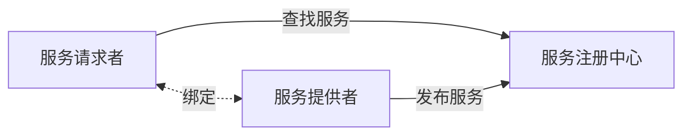

2022年5月左右的预测。

## 架构设计

软件架构 = 软件体系结构

架构在需求与软件设计之间，架构设计就是需求分配，即将满足需求的职责分配到组件上。

| 五大架构风格 |               子风格               |
| :-----------: | :--------------------------------: |
|  数据流风格  |        批处理、管道-过滤器        |
| 调用/返回风格 | 主程序/子程序、面向对象、层次结构 |
| 独立构件风格 | 进程通信、事件驱动系统（隐式调用） |
|  虚拟机风格  |          解释器、规则系统          |
|   仓库风格   |  数据库系统、黑板系统、超文本系统  |

### 基于服务的架构（SOA）

服务是一种为了满足某项业务需求的操作、规则等的逻辑组合，它包含一系列有序活动的交互，为实现用户目标提供支持。多个对象构成构件，多个构件构成服务。服务也可以说是标准化程度很高的构件。

服务与构件的几个比较：

| 比较方面 |            服务（构件）            |         （传统）构件         |
| :------: | :---------------------------------: | :--------------------------: |
|   粒度   |               粗粒度               |            细粒度            |
|   接口   |          标准，主要是WSDL          |           具体API           |
|   语言   |           实现与语言无关           |       绑定某种特定语言       |
|   控制   | 可以通过构件容器 提供QoS的服务 | 完全由程序代码 直接控制 |

SOA经典的应用场景之一是业务的集成。

SOA实现之一：Web Service

服务注册中心包含服务描述，服务提供者包含服务描述和服务。

一些在Web Service中常见的协议：

- 发现服务：UDDI
- 描述服务：WSDL
- 消息格式：SOAP、REST

SOA实现之二：企业服务总线（ESB）

ESB在服务请求者和服务提供者之间实现了解耦。企业服务总线提供位置透明性的消息路由和寻址服务，支持多种的消息传递类型，支持多种数据格式及其相互转换。

### 微服务

微服务属于面向服务架构的一种。特点是：小，专注一件事；轻量通信；松耦合、独立部署。

- 单块架构（Monolithic）：紧耦合，所有功能在一个进程中；扩展时需要基于整个系统扩展
- 微服务架构（Microservice）：松耦合，功能在不同的微服务进程中；基于独立服务，按需扩展

### 模型驱动架构（MDA）

MDA是形式化方法的一种，起源于分离系统规约和平台实现的思想。Model在这里指客观事物的抽象表示，Architecture在这里指构成系统的部件、连接件及其约束的规约。

MDA的主要目标：可移植性（Portability）、互通性（Interoperability）、可重塑性（Reusability）。

MDA有三种核心模型：

- 平台独立模型（platform independent model, PIM）：高抽象层次、独立于任何实现技术的模型；
- 平台相关模型（platform specific model, PSM）：为某种特定的实现技术量身定做，让你用这种技术中可用的实现构造来描述系统的模型。PIM会变成一个或多个PSM；
- 代码（Code）：用源代码对系统的描述（规约）。每个PSM都将被转换成代码。

## 系统设计

### 人机界面设计

- 置于用户控制之下，如允许用户交互可以被中断和撤销
- 减少用户的记忆负担，如界面的视角布局应该基于真实世界的隐喻
- 保持界面的一致性，如在应用内保持一致性

### 软件设计

包括体系结构设计、接口设计、数据设计和过程设计。

- 体系结构设计：定义软件系统各主要**部件之间的关系**
- 数据设计：将模型转换成**数据结构**的定义。好的数据设计将改善程序结构和模块划分，降低过程复杂性。
- 接口设计（人机界面设计）：软件内部、软件和操作系统间以及软件和人之间如何通信。
- 过程设计：系统结构部件转换成软件的过程描述。

### 结构化设计

结构化设计分为概要设计和详细设计。

- 概要设计（模块外部设计）：功能需求分配给软件模块，确定模块间的**调用关系**，形成**模块结构图**
- 详细设计（模块内部设计）：为每个**具体任务**选择适当的技术手段和**处理方法**

结构化设计最重要的原则：模块独立，即“**高内聚，低耦合**"，其他原则还有模块大小适中，多扇入少扇出（在依赖关系上入度多出度少），深度和宽度均不宜过高。

模块的四要素：

- 输入和输出
- 处理功能
- 内部数据（仅供该模块本身引用的数据）
- 程序代码

### 面向对象的设计

面向对象的设计原则：

* 单一职责原则：设计目的单一的类
* 开放-封闭原则：对扩展开放，对修改封闭
* 李氏（Liskov）替换原则：子类可以替换父类，即泛化
* 依赖倒置原则：要依赖于抽象，而不是具体实现；针对接口编程，不要针对实现编程
* 接口隔离原则：使用多个专门的接口比使用单一的总接口要好
* 组合重用原则：要尽量使用组合，而不是继承关系达到重用目的
* 迪米特 (Demeter）原则（最少知识原则)：一个对象应当对其他对象有尽可能少的了解

### 设计模式

- 架构模式：软件设计中的高层决策，例如C/S结构就属于架构模式，架构模式反映了开发软件系统过程中所作的基本设计決策
- 设计模式：主要关注软件系统的设计，与具体的实现语言无关
- 惯用法：是最低层的模式，关注软件系统的设计与实现，实现时通过某种特定的程序设计语言来描述构件与构件之间的关系。每种编程语言都有它自己特定的模式，即语言的惯用法。例如引用-计数就是C++语言中的一种惯用法
