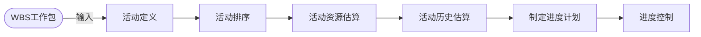

2022年5月左右的预测。

## 范围管理

确定项目的边界，即哪些工作使项目应该做的，哪些工作不应该包括在项目中。

范围定义的输入：项目章程、项目范围管理计划、批准的变更申请、组织过程资产。

范围创建的输出：WBS工作分解结构（Work Breakdown Structure）**明确范围**，便于估算，防止需求蔓延。最底层是工作包。WBS字典和WBS一起创建出。

## 时间管理

历时估算：

- 专家判断法
- 三点估算法：（乐观时间+4*最可能时间+悲观时间）/6
- 功能点估算法
- 自上而下的估算
- 自下而上的估算（比自上而下的准确）

偏离计划，分析是否为关键活动、偏差是否大于总时差、偏差是否大于自由时差。赶工：增加资源；快速跟进：活动并行执行。

### Pert分析

#### 前导图法（单代号网络图，PDM）

四种依赖方式：FS，FF，SS，SF。

- FS（最常见）：A结束后，B可以开始；
- FF：A结束后，B才能结束；
- SS：A开始后，B马上可以开始；
- SF：A开始后，B可以结束。

一般使用下图来在前导图法中标注任务的时间关系。

正向推倒出最早开始和完成时间，逆向填充最晚开始和完成时间。最早与最晚时间差为零的，即为关键活动；将关键活动连接起来，即为关键路径。

#### 箭线图法（双代号网络图，ADM）

箭线图中，只有FS。但是多出一个虚活动，既不占时间，也不占资源，但不能去除——表示了前导活动的依赖关系。虚活动也有可能在关键路径上。

#### 关键路径法

**总时差（松弛时间）：在不延误总工期的前提下，该活动的机动时间。活动的总时差等于该活动最迟完成时间与最早完成时间之差，或该活动最迟开始时间与最早开始时间之差。**

**自由时差：在不影响紧后活动的最早开始时间前提下，该活动的机动时间。**

* 对于有紧后活动的活动，其自由时差等于所有紧后活动最早开始时间减本活动最早完成时间所得之差的最小值。
* 对于没有紧后活动的活动，也就是以网络计划终点节点为完成节点的活动，其自由时差等于计划工期与本活动最早完成时间之差。
* 对于网络计划中以终点节点为完成节点的活动，其自由时差与总时差相等。
* 此外，由于活动的自由时差是其总时差的构成部分，所以，当活动的总时差为零时，其自由时差必然为零，可不必进行专门计算。

### 甘特图

- 优点：甘特图直观、简单、容易制作，清晰地标示出每一项任务的起始与结束时间，一般适用于较简单的小型项目；
- 缺点：不能系统地表达一个项目所包含的各项工作之间的复杂关系，难以进行定量的计算、分析和优化等。

### 例题

> 某工程包含ABCD四个任务，其衔接关系、正常进度下所需天数和所需直接费用、赶工进度下所需的最少天数和每天需要增加的直接费用见下表。该工程间接费用为每天五万元。据此，可以估算出完成该工程最少需要费用为多少万元，以此最低费用完成工程需要多少天？
>
> | 作业 | 紧前作业 | 正常进度所需天数 | 正常进度共需费用 | 赶工进度最少天数 | 赶工每天需增加直接费用 |
> | :--: | :------: | :--------------: | :--------------: | :--------------: | :--------------------: |
> |  A  |    -    |        3        |        10        |        1        |           4           |
> |  B  |    A    |        7        |        15        |        3        |           2           |
> |  C  |    A    |        4        |        12        |        2        |           4           |
> |  D  |    C    |        5        |        18        |        2        |           2           |

解题核心思想：压缩节省的间接费用 vs. 赶工增加的直接费用。首先尽量统一分支路径长度，然后依然按照前面的标准尝试哪些任务可以继续压缩。

答案为106万元，需要7天。

## 成本管理

确保项目在批准的预算条件下尽可能保质按期完成，而对所需的各个过程进行管理与控制。

- 成本估算：自顶向下的估算、自底向上的估算、差别估算法（与原来相似项目比较）。
- 成本预算：直接成本与间接成本、管理储备（应对不可预见的风险，项目经理不可擅动，高层审批）、零基准预算。
- 成本控制：挣值分析

### 挣值管理

- 计划工作量的预算成本PV，PV = 计划工作量 * 预算定额
- 已完成工作量的实际成本AC
- 已完成工作量的预算成本EV，EV = 已完成工作量 * 预算定额
- 完工预算，总预算BAC

---

- 进度偏差SV = EV - PV
- 成本偏差CV = EV - AC
- 进度绩效指数SPI = EV / PV
- 成本绩效指数CPI = EV / AC
- 剩余工作成本，非典型ETC = BAC - EV，典型ETC = (BAC - EV) / CPI。典型认为已发生的偏差具有代表性，后面还会产生相同分布的偏差。
- 完工估算EAC = AC + ETC

> 某信息化项目的成本执行（绩效）数据如下表，不正确的是
>
> PV：44100，AC：47750，EV：38410, BAC: 167500
>
> 1. 非典型偏差时，完工估算（BAC）为176840元
> 2. 该项目成本偏差为-9340元
> 3. 该项目进度绩效指数为0.80
> 4. 该项目目前成本超支，进度落后

1. EAC = AC + ETC = AC + (BAC - EV) = 176840，正确;
2. CV = EV - AC = -9340，正确
3. SPI = EV / PV = 0.87，不正确
4. CV为负数，进度指数小于1，正确

## 质量管理

- 质量保证：一般是每隔一定时间（例如，每个阶段末） 进行的，主要通过系统的质量审计和过程分析来保证项目的质量。独特工具包括：**质量审计和过程分析**
- 质量控制：实时监控项目的**具体结果**，以判断它们是否符合相关质量标准，制定有效方案，以消除产生质量问题的原因。

一定时间内质量控制的结果也是质量保证的质量审计对象。质量保证的成果又可以指导下一阶段的质量工作，包括质量控制和质量改进。

软件评审分为技术评审和管理评审。

### 软件过程改进CMMI

CMMI，软件能力成熟度集成。CMMI模型为开发或改进用于达成一个组织的商业目标的过程提供指导。一个CMMI模型也可能被用作用于评价组织的过程成熟度的框架。

CMMI阶段式：

二级，已管理级：项目级可重复

三级，已定义级：组织级，文档化标准化

四级，定量管理级：量化管理

五级，优化级：持续优化

CMMI另有连续式，内容本质与阶段式一致。

## 配置管理

- 基线配置项（可交付成果）：需求文档、设计文档、源代码、测试用例、运行软件所需的数据等
- 非基线配置项：各类计划，如项目管理计划、进度计划等

配置库：保存配置项和它的演进过程。配置库分为以下三种库：

- 开发库：也叫动态库、程序员库、工作库，保存**正在开发**的配置实体。
- 受控库：也叫主库，**管理基线**。
- 产品库：也叫静态库、软件仓库，**最终产品**。

### 配置项版本控制

处于草稿状态的配留项的版本号格式为：0.YZ，其中YZ数字范国为01~99。随者草稿的不断完善，YZ的取值应递增。YZ的初值和增幅由开发者自己把握。

处于正式发布状态的配置项的版本号格式为：XY。 其中X为主版本号，取值范国为1～9；Y为次版本号，取值范国为1～9。 配置项第一次正式发布时，版本号为1.0。

如果配置项的版本升級幅度比较小，一般只增大Y值，X值保持不变。只有当配置项版本升级幅度比较大时，才允许增大X值。

处于正在修改状态的配置项的版本号格式为：XYZ。在修改配置项时，一般只塔大Z值，XY值保持不变。

## 软件工具

- 软件开发工具：需求分析工具、设计工具、编码与排错工具
- 软件维护工具：版本控制工具、文档分析工具、开发信息库工具、逆向工程/再工程工具
- 软件管理和软件支持工具：项目管理工具、配置管理工具、软件评价工具

项目管理工具：能做项目管理相关的工作辅助，不能做开发技术相关辅助工作。
