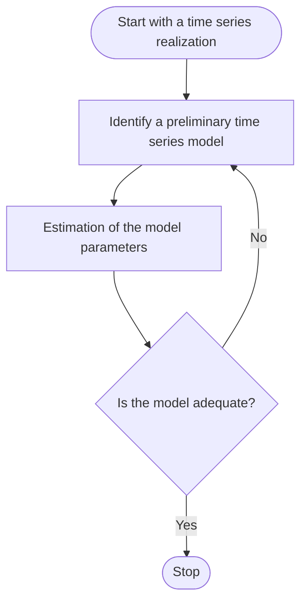

# Model-building strategy

## Box-Jenkins method for model-building strategy

## Three steps of building models

1. Model specification. The model is tentative at this moment and it is from the observed part of the time series. The model also should be chosen under the **principle of parsimony**.
2. Model fitting.
3. Model diagnostics. If inadequacies found, another model ought be considered until an acceptable model is found.

# Autocorrelation function (ACF)

For a $\text{MA}(q)$ process, it has the cut-off property, i.e. $\rho_q\ne0$ but $\rho_k=0$ for $k>q$.

For a $\text{AR}(p)$ or $\text{ARMA}(p,q)$ process, it decays to zero exponentially, but does not enjoy the cut-off property.

## Sample autocorrelation function

For a sequence of observations $Z_t,\dots,Z_n$ the sample autocorrelation function (sample ACF) is defined as follows.

$$
r_k=\frac{\hat{\gamma_k}}{\hat{\gamma_0}},\space\space k\ge0
$$

where $\hat{\gamma_k}$ is the $k$-th sample autocovariance:

$$
\hat{\gamma_k}=\frac{1}{n}\sum_{t=k+1}^n(Z_t-\bar Z)(Z_{t-k}-\bar Z),\space\space\bar Z=\frac{1}{n}\sum_{t=1}^nZ_t
$$

## Bartlett's approximation

The 95% approximate confidence interval of $r_k$ hence will be ($r_k$ denotes sampled $\rho_k$ here)

$$
\pm\frac{1.96}{\sqrt{n}}\sqrt{1+2r_1^2+\cdots+2r_{k-1}^2}
$$

The above confidence interval acts as the accepting region for the test with $H_0:ρ_k=0$.

In real applications, the original condition of the Bartlett’s approximation is usually ignored. The squared part are usually ignored. And the value of 1.96, the corresponding 95% percentile of the standard normality, is replaced by 2.0 in R.

# Partial autocorrelation function (PACF)

## Definition of partial autocorrelation

The partial autocorrelation (PACF) at lag $k$, denoted by $\phi_{kk}$, is defined as the solution to the system of equations:

$$
\begin{pmatrix}

1 & \rho_1 & \cdots & \rho_{k-1} \\

\rho_1 & 1 & \cdots & \rho_{k-2} \\

\vdots & \vdots & \ddots & \vdots \\

\rho_{k-1} & \rho_{k-2} & \cdots & 1

\end{pmatrix} \begin{pmatrix} \phi_{k1} \\ \phi_{k2} \\ \vdots \\ \phi_{kk} \end{pmatrix} 

= \begin{pmatrix} \rho_1 \\ \rho_2 \\ \vdots \\ \rho_k \end{pmatrix}
$$

Or, in other words, the equations are equivalent:

$$
\begin{pmatrix} \phi_{k1} \\ \phi_{k2} \\ \vdots \\ \phi_{kk} \end{pmatrix}
=
\begin{pmatrix}

1 & \rho_1 & \cdots & \rho_{k-1} \\

\rho_1 & 1 & \cdots & \rho_{k-2} \\

\vdots & \vdots & \ddots & \vdots \\

\rho_{k-1} & \rho_{k-2} & \cdots & 1

\end{pmatrix}^{-1}
\begin{pmatrix} \rho_1 \\ \rho_2 \\ \vdots \\ \rho_k \end{pmatrix}
$$

where $\{Z_t\}$ is a stationary time series with autocorrelation functions $\rho_m,m=1,2,3,\dots$

In particular:

1. $k=1$: $\phi_{11}=\rho_1$
2. $k=2$: we have

$$
\begin{pmatrix}\phi_{21} \\ \phi_{22}\end{pmatrix}=
\begin{pmatrix}
1 & \rho_1 \\ 
\rho_1 & 1
\end{pmatrix}^{-1}
\begin{pmatrix}\rho_1 \\ \rho_2 \end{pmatrix}
$$

Thus,

$$
\phi_{22}=\frac{\rho_2-\rho_1}{1-\rho_1^2}
$$

The PACF is to measure the direct impact from $Z_{t-k}$ at $Z_t$, with removing the middle terms from $Z_{t-1},\dots,Z_{t-k+1}$. So **for $\text{AR}(p)$ process, the PACF has a cut-off: $\phi_{kk}=0$ for $k>p$**. This property mirrors the cut-off property of the ACF of an $\text{MA}(q)$ process: $\rho_k=0$ for $k>q$.

For $\text{MA}(1)$ process $Z_t=a_t+\theta a_{t-1}$, we have

$$
\phi_{kk}=\frac{(-1)^{k+1}\theta^k}{1+\theta^2+\theta^4+\cdots+\theta^{2k}},\space\text{ for }k\ge1
$$

1. Notice that the partial autocorrelations of an $\text{MA}(1)$ model are never zero. Except the special case of $\theta^2=1$. They decay exponentially to zero, rather like the autocorrelation for an $\text{AR}(1)$ series.
2. The behaviors of PACF for ARMA processes is quite similar to that for MA processes.

## Sample PACF

For an observed time series, an obvious method is to estimate the $\rho$’s by $r$’s and then to solve the Yule-Walker equations to get estimates of $\phi_{kk}$, i.e.,

$$
\begin{pmatrix} \hat{\phi}_{k1} \\ \hat{\phi}_{k2} \\ \vdots \\ \hat{\phi}_{kk} \end{pmatrix}
=
\begin{pmatrix}

1 & r_1 & \cdots & r_{k-1} \\

r_1 & 1 & \cdots & r_{k-2} \\

\vdots & \vdots & \ddots & \vdots \\

r_{k-1} & r_{k-2} & \cdots & 1

\end{pmatrix}^{-1}
\begin{pmatrix} r_1 \\ r_2 \\ \vdots \\ r_k \end{pmatrix}
$$

## Inverse autocorrelation function (IACF) and the sample IACF

1. The sample IACF plays much the same role in ARIMA modeling as the sample PACF, but it generally indicates subset and seasonal autoregressive models better than the sample PACF.
2. Additionally, the sample IACF can be useful for detecting over-differencing.
3. The IACF is defined in the frequency domain. It is not often discussed in textbooks.

## Extended autocorrelation function (EACF) and the sample EACF

1. It can be used to identify the values of $p+d$ and $q$ for an $\text{ARIMA}(p,d,q)$.
2. It is not a very popular method.
3. There are other similar methods in the literature such as the corner method, the smallest canonical correlation (SCAN) method, etc..

# Nonstationarity

## How to determine the value of $d$ in $\text{ARIMA}(p,d,q)$ models

1. To determine the order of $d$ is equivalent to determine whether or not a sequence of values are from a stationary time series.
2. The definition of the sample ACF implicitly **assumes** stationarity.
3. However, for a nonstationary series, the sample ACF typically decays slowly as the lags increase.
4. If the sample ACF decays **slowly**, we may say the sequence is nonstationary. Otherwise, it is stationary.

## Overdifferencing

If a time series $\{Z_t\}$ is stationary, then the differenced sequence $\{\nabla Z_t\}$ is still stationary. Thus, we sometimes tend to overdifference the sequence.

To avoid overdifferencing, we should look carefully at each difference in succession and always keep in mind the principle of parsimony – **models should be as simple as possible**.

# Other specification methods

## Akaike information criterion (AIC)

This criterion is to select the model that minimizes

$$
\text{AIC}(k)=−2\log(\text{maximum likelihood})+2k
$$

where $k$ is the number of parameters. For an $\text{ARMA}(p,q)$ model, $k=p+q+1$ when the model contains an intercept, and $p+q$ otherwise.

## Bayesian information criterion (BIC)

This criterion is to select the model that minimizes

$$
\text{BIC}(k) = −2\log(\text{maximum likelihood})+k\log(n)
$$

The AIC is more popular in real applications although the BIC has a well justified theoretical basis.
