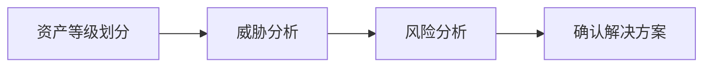

## 安全的本质

安全的本质是信任问题。所有的安全方案设计是建立在信任关系上的，作为方案的基本假设。如果基础假设被打破或绕过，则整个系统的处于不可靠状态。安全没有一劳永逸，它是一个持续的过程。

## 安全三要素（CIA）：

安全的三要素：机密性（Confidentiality）、完整性（Integrity）、可用性（Availability）。

- 机密性：不能泄漏
- 完整性：完整、不被篡改
- 可用性：随需而得，能满足正常需求

## 安全评估

- 资产登记划分：划分信任域与信任边界，一般从网络逻辑上来划分
- 威胁分析：即可能造成的危害来源。微软提出了威胁建模的Stride方法，也可以通过头脑风暴确定攻击面（Attack Surface）。
  - Spoofing 伪装
  - Tampering 篡改
  - Information Disclosure 信息泄漏
  - Denial of Service 拒绝服务
  - Elevation of Privilege 提升权限
- 风险分析：即可能出现的损失。风险分析要考虑到损失的大小与发生的可能性，即`Risk = Probability * Damage Potential`。微软提出了风险分析的Dread模型。
  - Damage Potential 危害程度
  - Reproducibility 可重复性
  - Exploitability 利用难度
  - Affected Users 影响面，影响用户
  - Discoverability 发现难度
- 设计安全方案：尽量不改变商业需求初衷；对用户透明，尽可能地不改变用户的使用习惯；易于持续改进。

## 四个安全原则

- Secure by Default 默认安全
  - 黑白名单：根据具体情况选择
  - 最小权限：只授予主体必要的权限，不过度授权
- Defense in Depth 纵深防御
  - 在各个不同的层面、不同方面实施安全方案，互相配合，形成整体
  - 在解决根本问题的地方实施针对性的安全方案
- 数据与代码分离：主要防范注入问题
- 不可预测性：对于默认值（如id、栈基址等）进行随机化处理
